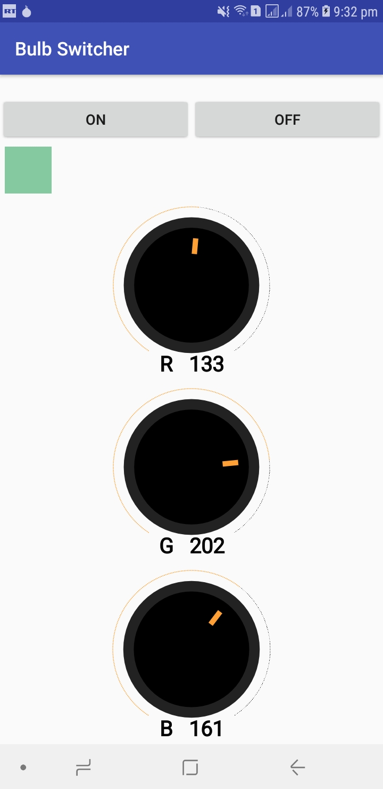
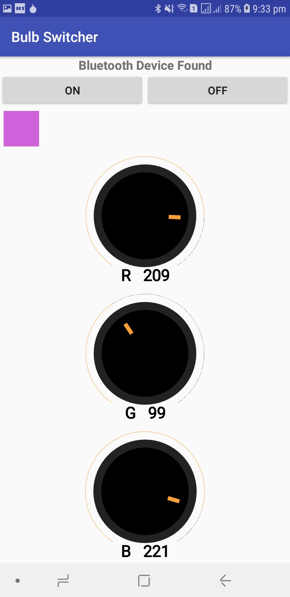

# Bulb Switcher Android app

  
 
## Join development!

**Build status:** master  stable 

**Start contributing:** Make sure you read [SETUP.md](https://github.com/owncloud/android/blob/master/SETUP.md) when you start working on this project. Basically: Fork this repository and contribute back using pull requests to the master branch.
Easy starting points are also reviewing [pull requests](https://github.com/owncloud/android/pulls) and working on [junior jobs](https://github.com/owncloud/android/issues?q=is%3Aopen+is%3Aissue+label%3A%22Junior+Job%22).

**IRC channel:** [#owncloud-android](https://webchat.freenode.net/?channels=owncloud-android) on freenode IRC

**License:** [GPLv2](https://github.com/owncloud/android/blob/master/LICENSE.txt)

## Join testing!

If you are interested in testing the new features before being released and give me your feedback, please try out our beta channels(i will upload some apk files)

